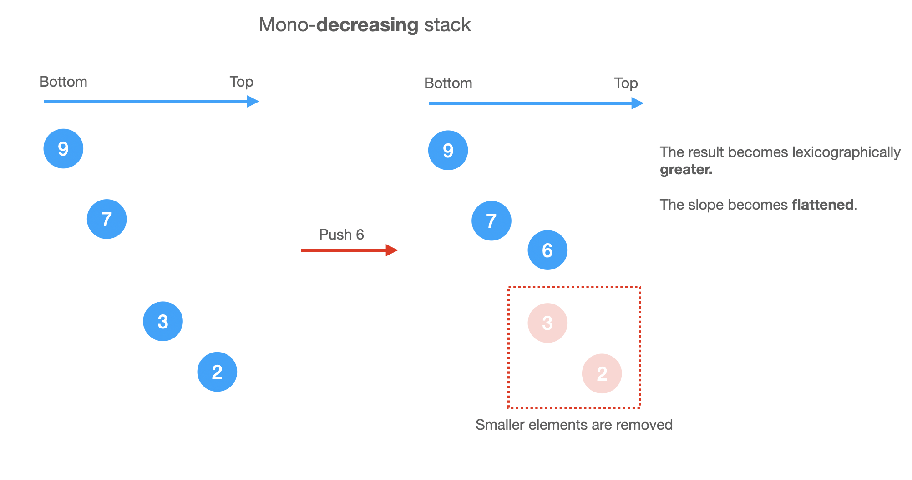

# Monotonic Stack

## Key Words

Sample keywords denoting **possible** use of monotonic stack

* _**in order**_
* _**lexicographically increasing or decreasing**_
* _**Max element/ min element**_

_****_

### _**Markdown Table**_

_****_

| Problem          | Stack Type                 | Operator in while loop | Assignment Position |
| ---------------- | -------------------------- | ---------------------- | ------------------- |
| next greater     | decreasing (equal allowed) | stackTop < current     | inside while loop   |
| previous greater | decreasing (strict)        | stackTop <= current    | outside while loop  |
| next smaller     | increasing (equal allowed) | stackTop > current     | inside while loop   |
| previous smaller | increasing (strict)        | stackTop >= current    | outside while loop  |

```
|  Problem           |  Stack Type                  |  Operator in while loop |  Assignment Position  |
|--------------------|------------------------------|-------------------------|-----------------------|
|  next greater      |  decreasing (equal allowed)  |  stackTop < current     |  inside while loop    |
|  previous greater  |  decreasing (strict)         |  stackTop <= current    |  outside while loop   |
|  next smaller      |  increasing (equal allowed)  |  stackTop > current     |  inside while loop    |
|  previous smaller  |  increasing (strict)         |  stackTop >= current    |  outside while loop   |
```

## Intro

A monotonic stack is a stack whose elements are monotonically increasing or descreasing.

Sometimes we store the index of the elements in the stack and make sure the elements corresponding to those indexes in the stack forms a mono-sequence.

## Increasing or decreasing?

If we need to pop **smaller** elements from the stack before pushing a new element, the stack is **decreasing** from bottom to top.

Otherwise, it's **increasing** from bottom to top.

For example,

```
Mono-decreasing Stack

Before: [5,4,2,1]
To push 3, we need to pop smaller (or equal) elements first
After: [5,4,3]
```

## When to use Monotonic Stack

* Since it has an O(n) complexity, it can be used as a solution to many **Range queries in an array** questions.
* To maintain **Maximum** and **Minimum** elements in range and keeps the order of the elements in the range.
* **Range queries in an array** problem
* When the **order** of the items needs to be maintained and if **each** needs to be compared to find the **min/max**
* If you see words like _**in order**_, _**lexicographically increasing or decreasing**_, _**Max element/ min element**_

## Notes

For a mono-**decreasing** stack:

* we need to pop **smaller** elements before pushing.
* it keep tightening the result as lexigraphically **greater** as possible. (Because we keep popping smaller elements out and keep greater elements).
* It might be neccessary to put not only an element inside the stack but a data structure like an **array** inside the stack to keep track of things like **position**, **frequency** etc ...
* Since the information contained inside the stack is limited, there might be a need to store an additional data outside the stack - e.g **max element** inside
* The algorithm, generally speaking, takes O(N) Time and O(N) Space as we are storing one element at a time and we do the callculations on one pass.
* If elements are _**not next to eachother**_ and a relationship is required between them, a 2 or more pass might be required. E.g - [Leetcode 316. Remove Duplicate letters](https://leetcode.com/problems/remove-duplicate-letters/)
* On last element/ sequence inside the monotonic stack, there might/ usually is an edge case where we might miss a value and that has to be put into consideration .. see example [402. Remove K Digits (Medium)](leetcode-402-remove-k-digits.md)



Take [402. Remove K Digits (Medium)](https://leetcode.com/problems/remove-k-digits/) for example, since we are looking for lexigraphically **smallest** subsequence, we should use mono-**increasing** stack.

## Problems

* [402. Remove K Digits (Medium)](https://leetcode.com/problems/remove-k-digits/)
* [496. Next Greater Element I (Easy)](https://leetcode.com/problems/next-greater-element-i/)
* [1019. Next Greater Node In Linked List (Medium)](https://leetcode.com/problems/next-greater-node-in-linked-list/)
* [503. Next Greater Element II (Medium)](https://leetcode.com/problems/next-greater-element-ii/)
* [1475. Final Prices With a Special Discount in a Shop (Easy)](https://leetcode.com/problems/final-prices-with-a-special-discount-in-a-shop/)
* [84. Largest Rectangle in Histogram (Hard)](https://leetcode.com/problems/largest-rectangle-in-histogram/)
* [85. Maximal Rectangle (Hard)](https://leetcode.com/problems/maximal-rectangle/)
* [456. 132 Pattern (Medium)](https://leetcode.com/problems/132-pattern/)
* [1504. Count Submatrices With All Ones (Medium)](https://leetcode.com/problems/count-submatrices-with-all-ones/)
* [1673. Find the Most Competitive Subsequence (Medium)](https://leetcode.com/problems/find-the-most-competitive-subsequence/)
* [907. Sum of Subarray Minimums (Medium)](https://leetcode.com/problems/sum-of-subarray-minimums/)
* [1856. Maximum Subarray Min-Product (Medium)](https://leetcode.com/problems/maximum-subarray-min-product/)
* [1124. Longest Well-Performing Interval (Medium)](https://leetcode.com/problems/longest-well-performing-interval/)
